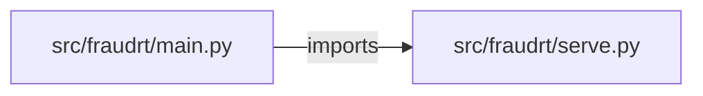

# realtime-fraud-detection — project architecture

[README](README.md) · [Interview questions and answers](INTERVIEW_QA.md)

## Purpose and scope

Transaction → features → model → risk score → fraud/legitimate. Cache lookups; no card is charged.

This document describes files and symbols in this checkout. Deployment templates and statements in the original overview are distinguished from a verified running environment.

## Component diagram



For Python repositories, arrows show resolved local imports, not network calls or deployment order. Otherwise the diagram is a repository component map; containment arrows do not assert runtime integration.

## Components and responsibilities

| Component | Responsibility |
| --- | --- |
| [`src/fraudrt/main.py`](src/fraudrt/main.py) | HTTP handlers: `GET /healthz`, `POST /score`, `GET /events` |
| [`src/fraudrt/serve.py`](src/fraudrt/serve.py) | Functions: `clf`, `score` |
| [`requirements.txt`](requirements.txt) | Implementation or supporting configuration |
| [`tests/test_fraud.py`](tests/test_fraud.py) | Executable checks and regression examples |
| [`.github/workflows/ci.yml`](.github/workflows/ci.yml) | GitHub Actions job definitions |
| [`README.md`](README.md) | Project explanations or operating notes |

## Request interface

| Method and path | Handler | Source |
| --- | --- | --- |
| `GET /healthz` | `healthz` | [`src/fraudrt/main.py`](src/fraudrt/main.py#L6) |
| `POST /score` | `post_score` | [`src/fraudrt/main.py`](src/fraudrt/main.py#L10) |
| `GET /events` | `events` | [`src/fraudrt/main.py`](src/fraudrt/main.py#L17) |

The table lists literal route decorators found in the inspected Python modules. Router prefixes and middleware can add behavior; check the linked handler and application setup before calling an endpoint.

## Implementation walkthrough

### `score(tx, idempotency_key=None)`

Source: [`src/fraudrt/serve.py`](src/fraudrt/serve.py#L15).

Calls visible in this function: `EVENTS.append`, `ValueError`, `clf`, `clf().predict_proba`, `float`, `isinstance`, `round`, `tx.get`.

```python
def score(tx, idempotency_key=None):
    if idempotency_key and idempotency_key in CACHE:
        return {**CACHE[idempotency_key], "cached": True}
    for f in FEATURES:
        if not isinstance(tx.get(f), (int, float)) or isinstance(tx.get(f), bool):
            raise ValueError(f"{f} must be a number")
    proba = float(clf().predict_proba([[tx[f] for f in FEATURES]])[0][1])
    result = {"probability": round(proba, 4), "label": "fraud" if proba >= 0.5 else "legitimate", "charged": False, "cached": False}
    EVENTS.append(result)
    if idempotency_key:
        CACHE[idempotency_key] = result
    return result
```

### `clf()`

Source: [`src/fraudrt/serve.py`](src/fraudrt/serve.py#L8).

Calls visible in this function: `GradientBoostingClassifier`, `lru_cache`, `m.fit`.

```python
def clf():
    X = [[12,0,1],[20,0,1],[900,1,8],[40,0,2],[1100,1,9],[15,0,1],[800,1,7],[30,0,1]]
    y = [0,0,1,0,1,0,1,0]
    m = GradientBoostingClassifier(random_state=0)
    m.fit(X, y)
    return m
```

## Validation and failure paths

| Explicit exception | Source |
| --- | --- |
| `HTTPException(422, str(exc))` | [`src/fraudrt/main.py`](src/fraudrt/main.py#L14) |
| `ValueError(f'{f} must be a number')` | [`src/fraudrt/serve.py`](src/fraudrt/serve.py#L20) |

These are explicit exceptions in the inspected source, rather than a claim that every failure is handled. Follow the calling handler to see whether the exception becomes an HTTP response or propagates.

## Data and state

- [`src/fraudrt/serve.py`](src/fraudrt/serve.py) defines module-level containers: `CACHE`, `EVENTS`, `FEATURES`.

Module-level dictionaries/lists live in a Python process. They can be fixtures or mutable state; inspect writes before treating them as persistent storage. A production extension would need to define persistence and concurrency behavior explicitly.

## Data flow and design decisions

### What is the input-to-output contract of `score`

In [`src/fraudrt/serve.py`](src/fraudrt/serve.py#L15), `score(tx, idempotency_key=None)` receives the inputs. The function computes these intermediate values:

- `proba = float(clf().predict_proba([[tx[f] for f in FEATURES]])[0][1])`
- `result = {'probability': round(proba, 4), 'label': 'fraud' if proba >= 0.5 else 'legitimate', 'charged': False, 'cached': False}`

Its result is defined by:

- `result`
- `{**CACHE[idempotency_key], 'cached': True}`

### Which decision rules or boundary conditions should an interviewer challenge

The implementation in [`src/fraudrt/serve.py`](src/fraudrt/serve.py#L15) branches on:

- `idempotency_key and idempotency_key in CACHE`
- `idempotency_key`
- `not isinstance(tx.get(f), (int, float)) or isinstance(tx.get(f), bool)`

A useful extension is a table-driven test that covers each condition just below, at, and above its boundary where applicable. These expressions are the current rules; changing them changes behavior and should be justified by the project’s acceptance criteria.

## Setup and verification

The following commands are derived from the checked-in dependency/test contracts. Execute them from the repository root; the block prepares a local environment, not a cloud deployment.

```bash
python3 -m venv .venv
source .venv/bin/activate
python -m pip install -r requirements.txt
python -m pytest -q
```

Python dependencies: [`requirements.txt`](requirements.txt).

Test entry points: [`tests/test_fraud.py`](tests/test_fraud.py).

Automation definitions: [`.github/workflows/ci.yml`](.github/workflows/ci.yml). Read their triggers and job steps to determine what CI actually runs.

## Operating boundaries and design review

Before turning this checkout into a customer deployment, establish the input contract, data ownership, access controls, failure response, evaluation criteria, and rollback owner. Repository fixtures and unit tests demonstrate local behavior; they do not establish throughput, uptime, compliance, or business impact.

A useful architecture review starts with the linked implementation: identify where input enters, where a decision is made, which state can change, and which external dependency can fail. Add a deployment view only for infrastructure that is actually configured and exercised.
